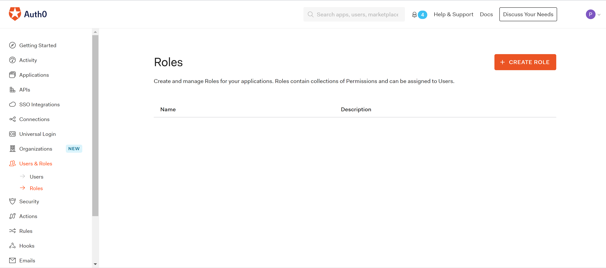

# Role Based Authentication for .NET Core APIs with Auth0

Auth0 offers two alternatives for implementing authorization in an API, scopes and roles.

Scopes represent access levels exposed by an API that users can grant to client applications on his/her behalf. For example, "read emails" or "write calendar", which gives a client application permissions to read the user's emails o write the calendar. 

On other hand, roles represent the old school for doing authorization. Users are assigned to roles with one or more permissions. Those permissions are passed to the API when the user invokes it through a client application. In Auth0, roles are configured through a feature called [Role Based Access Control](https://auth0.com/docs/authorization/rbac/) or RBAC in short.

It is worth mentioning that only scopes are mentioned as part of the OAuth 2.0 specification, and roles are usually implemented in proprietary ways by different vendors. As Auth0 uses JWT for representing access tokens, it relies on extension attributes for injecting the permissions for a role into the tokens. We will cover this more in detail later in this post.

For the API, we will use the one included as template with Visual Studio for .NET Core that returns the weather forecast.

## Creating an API in Auth0

First step before jumping into any API implementation is to configure the API in the Auth0 dashboard. 

Go the APIs and click on Create API


Under the settings tab, configure the following fields.

* **Name**, a friendly name or description for the API. Enter **Weather Forecast API* for this sample.
* **Identifier** or **Audience**, which is a identifier that client application uses to request access tokens for the API. Enter **https://weatherforecast**.
* Under RBAC settings, enable **RBAC** and **Add Permissions in the Access Tokens**. This will be used by Auth0 to inject the user's permissions into the access tokens.

Under the permissions tab, add a new permission **read-weather** with a description **It allows getting the weather forecast**. This is the permission that Auth0 will inject in the JWT token if the user is member of any of the roles that are allowed to execute that operation. 
  
Finally, click on the Save button to save the changes. At this point, our API is ready to be used from .NET Core.

## Adding a new role in Auth0

Under User & Roles, click on **Create Role** to define a new Role for our API.



On the **Settings** tab, enter **meteorologist* as role name and description.

On the **Permissions** tab, click on **Add Permissions**, select our  **Weather Forecast API* from the dropdown, and **read-weather** as permission. Click on **Add Permissions*

## Assign the role to existing users

As final step for the API configuration in Auth0, we need to assign the **meteorologist** role to any of the users you will be using for testing the API. If you do not have one yet, you will have to create it and assign it to this role.
Roles are assigned by clicking on the ellipsis button **...** available on each user in the list, and selecting **Assign Roles** option from the displayed menu.

## Anatomy of the JWT access token

If everything is configured correctly, any access token issued by Auth0 for our API should look like the one below,

```json
{
  "iss": "https://....us.auth0.com/",
  "sub": "auth0|...",
  "aud": "https://weatherforecast",
  "iat": 1621346933,
  "exp": 1621354133,
  "azp": "nW5WUNks1eQgHZB0oyc9183NNILpsWMe",
  "scope": "",
  "permissions": [
    "read:weather"
  ]
}
```

## Create the ASP.NET Core API in Visual Studio

Visual Studio ships with a single template for .NET Core APIs. That is **ASP.NET Core Web API** as it is shown in the image below.


### The structure of the project

Projects created with that template from Visual Studio will have the following structure.


- Controllers, this folder contains the controllers for the API implementation.
- Startups.cs, this is the main class where the ASP.NET Core Middleware classes are configured as well as the dependency injection container.
 
### Configuring the project

Our application will only use a middleware for supporting authentication with JWT as bearer tokens.

Open the Package Manager Console for Nuget in Visual Studio and run the following command.

```
Install-Package Microsoft.AspNetCore.Authentication.JwtBearer
```

Once the Nuget packages are installed in our project, we can go ahead and configure them in the Startup.cs class.

Modify the ConfigureServices method in that class to include the following code.

```csharp
public void ConfigureServices(IServiceCollection services)
{
  var authentication = services
    .AddAuthentication(JwtBearerDefaults.AuthenticationScheme)
    .AddJwtBearer("Bearer", c =>
    {
       c.Authority = $"https://{Configuration["Auth0:Domain"]}";
       c.TokenValidationParameters = new TokenValidationParameters
       {
         ValidateAudience = true,
         ValidAudiences = Configuration["Auth0:Audience"].Split(";"),
         ValidateIssuer = true,
         ValidIssuer = $"https://{Configuration["Auth0:Domain"]}";
       };
  });

  services.AddControllers();
            
   services.AddSwaggerGen(c =>
   {
     c.SwaggerDoc("v1", new OpenApiInfo { Title = "Api", Version = "v1" });
   });

   services.AddAuthorization(o =>
   {
     o.AddPolicy("read-weather", policy => 
       policy.RequireClaim("permissions", "read:weather"));
    });
}
```
This code performs two things. It configures the JWT middleware to accept access tokens issued by Auth0, and an authorization policy for checking the permissions set on the token. 
The policy checks for a claim or attribute called **permissions** with a value **read:weather**, which is the permission we previously configured for our API in the Auth0 dashboard.
The middleware configuration relies on some settings that we will configure later in the appSettings.json file associated to the application.

Next step is to modify the Configure method to tell ASP.NET Core that we want to use the Authentication And Authorization Middleware. 

Insert the following code as it shown below.

```
public void Configure(IApplicationBuilder app, IWebHostEnvironment env)
{
...
  app.UseRouting();
            
  app.UseAuthentication();

  app.UseAuthorization();

...
  app.UseEndpoints(endpoints =>
  {
    endpoints.MapControllers();
  });
}
```

Create a new appSettings.json file and include the settings we got from the Auth0 dashboard before. Those are Domain, and API's Audience.

```
{
  "Logging": {
      "LogLevel": {
      "Default": "Information",
      "Microsoft": "Warning",
      "Microsoft.Hosting.Lifetime": "Information"
      }
    },
  "AllowedHosts": "*",
  "Auth0": {
    "Domain": "<domain>",
    "Audience": "https://weatherforecast"
  }
}
```

### Require authentication in other controllers
The WeatherForecast controller included in the template allows anonymous calls. We will convert it to require authenticated calls. Fortunately, that is as simple as adding a top level [Authorize] attribute in the class definition. That attribute will also reference the policy we previously defined in the Startup.cs file.

```csharp
[ApiController]
[Authorize("read-weather")]
[Route("[controller]")]
public class WeatherForecastController : ControllerBase
{
```

This attribute will do two things,

- It will activate the Authorization Middleware that will check if the call was authenticated and there is one user identity set in the current execution context.
- It will run the **read-weather** policy to make sure the user identity contains the required permissions.

Once we ran this project in Visual Studio, the API will only accept authenticated calls with JWT tokens coming from Auth0.

## Summary

We discussed two of the authorization alternatives available for you in Auth0 when implementing an API in .NET core, and selected **RBAC** for our sample. We also showed how to configure the ASP.NET Core Middleware for Authentication and Authorization, and how to use Authorization Policies for checking permissions on the JWT bearer tokens. 
In a next post, we will see how to implement a client application that negotiates access tokens from Auth0 to consume this API.